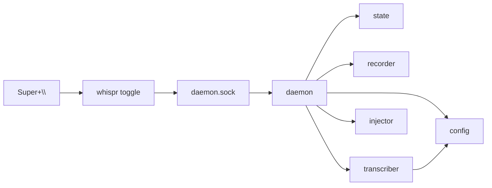

# whispr-local v1 — full implementation

On-device GNOME/Wayland dictation on the Intel NPU. Design: `docs/design/v1_design.md` · ADRs: [0001](../../docs/adr/0001-warm-daemon-architecture.md) (warm daemon), [0002](../../docs/adr/0002-wayland-injection-via-ydotool.md) (Wayland injection) · Glossary: Dictation, Toggle, Transcript, Injection, Daemon, State.

> **Implementation:** build with the `/tdd` skill if available — work one slice at a time,
> 🔴 red → 🟢 green → refactor, asserting behavior through the public interface.

## Invariants & decisions
- **Warm Daemon, model loaded once.** Never load Whisper per Dictation (ADR-0001).
- **Hotkey → `whispr toggle` → Unix socket** `~/.cache/whispr/daemon.sock`. Client exits non-zero + notifies when the Daemon is absent.
- **Injection = `wl-copy` + `ydotool key ctrl+v`; clipboard NOT restored** (ADR-0002). No `xdotool`/`xclip`/`wtype`.
- **State machine is pure** (no I/O). Transitions exactly: IDLE+toggle→RECORDING; RECORDING+toggle→TRANSCRIBING; RECORDING+cancel→IDLE; TRANSCRIBING+toggle→TRANSCRIBING (reject-busy); TRANSCRIBING+complete→IDLE.
- **Device decided once at startup, sticky.** Try `device` (default NPU); on init exception fall back to CPU + notify. Never re-probe per Dictation.
- **GLib main loop never blocks** — `WhisperPipeline.generate()` + Injection run on a worker thread.
- **Audio in-process** via `sounddevice` at 16 kHz mono float32, numpy buffer in RAM (no WAV; optional debug dump).
- **Pure core (`state`, `ipc`, `config`) imports no other `whispr` module.** `daemon` is the only wiring layer.
- **Seams for the untestable-in-isolation modules:** `Recorder(stream_factory)`, `Transcriber(pipeline_factory)`, `Injector(run)` — each takes its I/O dependency injected so logic is AFK-testable with a fake.
- uv project, **Python 3.12**, `src/whispr/` layout, single `whispr` console script.

## Architecture
Module map (roles): `cli.py` dispatch · `daemon.py` GLib loop + socket server + worker dispatch + wiring · `state.py` pure transition table · `ipc.py` socket server/client + framing · `config.py` TOML load/validate · `recorder.py` sounddevice→buffer · `transcriber.py` WhisperPipeline + fallback · `injector.py` wl-copy+ydotool. Seams = the three injected factories above; the fake versions live in `tests/`.



## Build order

### Slice 1 — Scaffold + IPC round-trip (tracer bullet)   `AFK` · group root · blocked-by: none   {#slice-scaffold-ipc}
🔴 **Red** — `tests/test_ipc.py::test_command_round_trips_over_socket`: a client that sends `"toggle"` to a server bound on a temp-dir Unix socket receives the server's reply, and both encode/decode through the framing unchanged.
🟢 **Green** — uv project (py3.12, `whispr` console script); `ipc.py` with `encode`/`decode` framing + `serve(sock_path, handler)` and `send(sock_path, command) -> reply`; `cli.py` with `toggle` wired to `ipc.send`; a throwaway handler returning `ok`.
**Design**
- Framing: length-prefixed or newline-delimited JSON `{cmd, ...}` → `{status, state?, device?}`. Keep `encode`/`decode` pure (this is the unit-tested part); the socket loop is the integration harness.
- Socket path from XDG cache; create parent dir; unlink stale socket on bind.
**Done when** — the round-trip test is green; `whispr --help` lists `daemon|toggle|status|cancel`; no hardware touched.

### Slice 2 — Pure State machine   `AFK` · group pure · blocked-by: slice-scaffold-ipc   {#slice-state}
🔴 **Red** — `tests/test_state.py::test_transitions`: parametrized over the five transitions; asserts `transition(TRANSCRIBING, toggle) == (TRANSCRIBING, REJECT_BUSY)` and `transition(RECORDING, cancel) == (IDLE, DISCARD)` — i.e. reject-while-busy and cancel, plus the two happy toggles and complete.
🟢 **Green** — `state.py`: `State` enum, `Event` enum, `Effect` enum, pure `transition(state, event) -> (next, effect)` per the invariant table.
**Design**
- No I/O, imports nothing internal. Unknown `(state, event)` pairs → return same state + a `NOOP`/`REJECT_BUSY` effect (never raise on a stray Toggle).
**Done when** — every transition row green; module has zero `whispr`-internal imports.

### Slice 3 — Config loader   `AFK` · group pure · blocked-by: slice-scaffold-ipc   {#slice-config}
🔴 **Red** — `tests/test_config.py::test_defaults_and_expansion`: missing file → all documented defaults (`device="NPU"`, `notify=True`, `dump_last_recording=False`, XDG `model_path`/`cache_dir`); `~`/`$HOME` in paths expanded; `device` normalized (`"npu"`→`"NPU"`), unknown device rejected.
🟢 **Green** — `config.py`: `load(path=None) -> Config` using `tomllib`; dataclass with defaults; path expansion; device validation.
**Design**
- Partial TOML overlays defaults (only-`device`-set works). Invalid TOML → clear error, not a crash.
**Done when** — defaults, overlay, expansion, and device-normalization cases green; no other `whispr` imports.

### Slice 4 — Client-absent behavior   `AFK` · group root · blocked-by: slice-scaffold-ipc   {#slice-client-errors}
🔴 **Red** — `tests/test_ipc.py::test_send_reports_daemon_absent`: `ipc.send` against a non-existent socket raises/returns a typed "daemon not running" result (not a bare `ConnectionRefusedError`), and `cli` maps it to exit code 1.
🟢 **Green** — catch connect refusal in `ipc.send` → `DaemonUnavailable`; `cli.toggle/status` catch it → `notify-send` + `sys.exit(1)`.
**Done when** — absent-daemon test green; pressing the hotkey with no Daemon yields a clear notification, not a traceback.

### Slice 5 — Recorder behind a stream seam   `AFK` · group modules · blocked-by: slice-scaffold-ipc   {#slice-recorder}
🔴 **Red** — `tests/test_recorder.py::test_start_stop_returns_mono_f32_buffer`: with a fake stream-factory that emits known frames, `Recorder.start()` then `.stop()` returns a concatenated 1-D float32 numpy array at 16 kHz of the expected length.
🟢 **Green** — `recorder.py`: `Recorder(stream_factory=make_sounddevice_stream)`; `start()` opens an InputStream (callback appends frames), `stop()` closes and concatenates. Real factory requests `samplerate=16000, channels=1, dtype='float32'`.
**Design**
- Callback runs on PortAudio's thread; append to a list, concat on stop (no locks needed for append-only + stop barrier). Empty buffer → zero-length array (drives the "no speech" path downstream).
**Done when** — fake-stream test green; real factory is a thin, un-unit-tested adapter.

### Slice 6 — Transcriber device selection + fallback   `AFK` · group modules · blocked-by: slice-scaffold-ipc   {#slice-transcriber}
🔴 **Red** — `tests/test_transcriber.py::test_npu_failure_falls_back_to_cpu`: with a fake pipeline-factory that raises when asked for `"NPU"` and succeeds for `"CPU"`, `Transcriber(config, factory)` ends up with `active_device == "CPU"` and still transcribes; a second call does **not** re-probe NPU (sticky).
🟢 **Green** — `transcriber.py`: `Transcriber(config, pipeline_factory=make_whisper_pipeline)`; build once at init, try `config.device` then fall back to `"CPU"` on exception, store `active_device`; `transcribe(buffer) -> str`. Real factory constructs `WhisperPipeline(model_path, device=..., CACHE_DIR=config.cache_dir)`.
**Design**
- Fallback + notify happen at construction; `transcribe` is pure over the warm pipeline. `device="CPU"` in config skips the NPU attempt entirely.
**Done when** — fallback + stickiness green with fakes; real openvino-genai wiring compiles (pin-resolution proven here — open question #1).

### Slice 7 — Injector behind a runner seam   `AFK` · group modules · blocked-by: slice-scaffold-ipc   {#slice-injector}
🔴 **Red** — `tests/test_injector.py::test_inject_copies_then_pastes`: `Injector(run=fake_run).inject("héllo, world")` calls `wl-copy` with the exact text on stdin, **then** `ydotool key ctrl+v`, in that order; empty string → no calls.
🟢 **Green** — `injector.py`: `Injector(run=subprocess.run)`; `inject(text)` → `wl-copy` (text via stdin) then `ydotool key ctrl+v`. Optional settle delay is a config knob, default 0 (open question #3, tune on hardware).
**Done when** — order + unicode-passthrough + empty-skip green against the fake runner.

### Slice 8 — Daemon: Toggle → State   `AFK` · group daemon · blocked-by: slice-state, slice-scaffold-ipc   {#slice-daemon-toggle-state}
🔴 **Red** — `tests/test_daemon.py::test_two_toggles_advance_state`: driving the Daemon's socket handler with fakes for recorder/transcriber/injector, one `toggle` → `status` reports `RECORDING`; a second → `TRANSCRIBING`; a third while transcribing → reply `busy`, State unchanged.
🟢 **Green** — `daemon.py`: hold `State`, on each socket command call `state.transition`, map the returned `Effect` to injected collaborators (fakes in test), reply with `{status, state, active_device}`. `status` command reports without mutating.
**Design**
- Effects mapped: `START_RECORDING→recorder.start`, `STOP_AND_DISPATCH→recorder.stop`+enqueue, `REJECT_BUSY→reply busy`, `DISCARD→drop buffer`. Injection deferred to next slice.
**Done when** — toggle/reject/status behavior green with fakes; no GLib/hardware needed in the test (drive the handler directly).

### Slice 9 — Daemon full lifecycle on worker thread   `AFK` · group daemon · blocked-by: slice-daemon-toggle-state, slice-recorder, slice-transcriber, slice-injector   {#slice-daemon-lifecycle}
🔴 **Red** — `tests/test_daemon.py::test_dictation_end_to_end_with_fakes`: two Toggles with a fake recorder (known buffer), fake transcriber (returns `"hello"`), fake injector; after the worker completes, the injector received `"hello"` and State is back to `IDLE`. Assert the dispatch call returns **before** the fake transcriber finishes (non-blocking).
🟢 **Green** — worker-thread dispatch: `STOP_AND_DISPATCH` hands the buffer to a worker that runs `transcriber.transcribe` then `injector.inject`, then posts `complete` back to advance State to IDLE. Main handler returns immediately.
**Design**
- One worker at a time (State already forbids concurrent Dictations). Post `complete` back onto the loop thread (GLib idle-add) so State mutation stays single-threaded.
**Done when** — end-to-end-with-fakes green, including the non-blocking assertion; prior slices still green.

### Slice 10 — Empty Transcript + cancel   `AFK` · group daemon · blocked-by: slice-daemon-lifecycle   {#slice-empty-and-cancel}
🔴 **Red** — `tests/test_daemon.py::test_empty_transcript_notifies_no_injection` and `::test_cancel_discards_recording`: empty string from transcriber → notify "no speech", injector NOT called, State IDLE; `cancel` during RECORDING → State IDLE, transcriber NOT called.
🟢 **Green** — guard empty transcript before Injection; wire `cancel` command → `Event.cancel` → `DISCARD`.
**Done when** — both behaviors green.

### Slice 11 — Config wiring   `AFK` · group daemon · blocked-by: slice-config, slice-daemon-lifecycle   {#slice-config-wiring}
🔴 **Red** — `tests/test_daemon.py::test_config_controls_behavior`: `notify=False` suppresses notifications; `dump_last_recording=True` writes a WAV to the cache dir; `device` is passed through to the Transcriber.
🟢 **Green** — construct collaborators from `config.load()` at Daemon startup; thread `notify`/`dump_last_recording`/`device`/`cache_dir` through.
**Done when** — config-driven behaviors green; `whispr daemon` reads `~/.config/whispr/config.toml` (defaults if absent).

### Slice 12 — Setup, service, model export   `HITL` · group setup · blocked-by: slice-config-wiring   {#slice-setup-scripts}
🔴 **Red** — no unit test (touches sudo/systemd/gsettings/hardware); verified by execution on the target machine.
🟢 **Green** — `scripts/export-model.sh` (`optimum-cli export openvino … whisper-base … --weight-format int8` → `~/.local/share/whispr/models/`); `systemd/whispr.service` (`--user`, `ExecStart=whispr daemon`); `scripts/setup-system.sh`: APT deps (`libportaudio2 wl-clipboard ydotool libnotify-bin` + AppIndicator libs), uinput udev rule + `input` group + `ydotoold --user`, **NPU driver check (warn `< 32.0.100.3104`)**, install+enable `whispr` service, bind `Super+\`→`whispr toggle` via `gsettings`, offer to run `export-model.sh` if no model present.
**Design**
- Print every `sudo` action before running it; loudly instruct re-login for the `input` group change.
**Done when** — on the ZenBook: `whispr daemon` autostarts, `whispr status` shows the active device, `gsettings` shows the `Super+\` binding.

### Slice 13 — MVP-0 acceptance   `HITL` · group setup · blocked-by: slice-setup-scripts   {#slice-acceptance}
🔴 **Red** — manual acceptance, no automated test.
🟢 **Green** — run the full flow on real hardware.
**Design / acceptance checklist**
- Daemon logs the **winning device (NPU vs CPU)** + model-load time; NPU confirmed.
- `Super+\` → speak → `Super+\` puts text into a focused **editor** and a **browser field**.
- Transcript **stays on the clipboard** → manual Ctrl+V re-paste works.
- Force `device="CPU"`, restart → still works (fallback path proven in anger).
**Done when** — all four checks pass hands-free via the physical hotkey.

## Parallelization
- **DAG**:
  `slice-scaffold-ipc → { slice-state, slice-config, slice-client-errors, slice-recorder, slice-transcriber, slice-injector }`
  `{slice-state} → slice-daemon-toggle-state`
  `{slice-daemon-toggle-state, slice-recorder, slice-transcriber, slice-injector} → slice-daemon-lifecycle → slice-empty-and-cancel`
  `{slice-config, slice-daemon-lifecycle} → slice-config-wiring → slice-setup-scripts → slice-acceptance`
- **Critical path**: `scaffold-ipc → state → daemon-toggle-state → daemon-lifecycle → config-wiring → setup-scripts → acceptance`.

## Parallel execution (subagent dispatch)
- **Group pure + modules** (all after `slice-scaffold-ipc`): dispatch `slice-state`, `slice-config`, `slice-client-errors`, `slice-recorder`, `slice-transcriber`, `slice-injector` to separate subagents — **each owns one new file** (`state.py`/`config.py`/`recorder.py`/`transcriber.py`/`injector.py`) plus its own test file, so no shared-file contention (`slice-client-errors` edits `ipc.py`/`cli.py` — keep it off the same agent as any future `ipc` change).
  - **model**: default each to `composer-2.5-fast`. Escalate **`slice-transcriber`** to `gpt-5.4` (medium) — OpenVINO/NPU pin resolution + sticky-fallback semantics are the one genuinely fiddly piece.
  - each subagent gets: its Red/Green/Design block + the Invariants section + its seam signature; returns a diff + passing test.
- **Main thread only**: `slice-scaffold-ipc` (shared scaffold), `slice-daemon-*` (all edit `daemon.py`), and both `HITL` setup slices.
- **Integration/merge order**: scaffold → merge the six parallel modules → daemon slices in sequence (single owner of `daemon.py`) → config-wiring → HITL.

## Dependencies / setup
- **uv deps**: `uv add sounddevice numpy openvino-genai optimum-intel transformers nncf onnx`; dev: `uv add --dev pytest`. Resolve the NPU-sensitive pins under py3.12 during `slice-transcriber` (open question #1) — start from the reference pins (`openvino*==2026.2.1`, `optimum-intel==1.25.2`, `transformers==4.51.3`, `nncf==2.18.0`, `onnx==1.18.0`) and adjust the lock as needed.
- **System deps** (via `slice-setup-scripts`, not uv): `libportaudio2`, `wl-clipboard`, `ydotool`, `libnotify-bin`, `libayatana-appindicator3-1`, `gir1.2-ayatanaappindicator3-0.1`.
- **Fixtures**: fake stream-factory (known frames), fake pipeline-factory (NPU-raises/CPU-ok), fake command-runner (records argv+stdin), temp-dir socket path.
- **Open questions carried into build (per your call):** #1 pin resolution → settled in `slice-transcriber`; #4 arecord→sounddevice ADR → decide during `slice-recorder` (lean: no ADR). #3 injection settle delay → tune in `slice-acceptance`.
```
