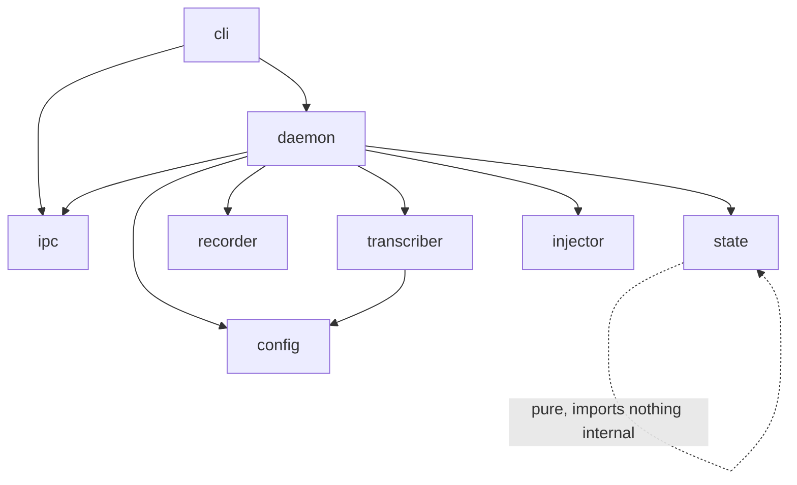

# Design — whispr-local v1

> Design note for review. Decisions are recorded in the linked ADRs; this renders the technical
> shape. Links: [ADR-0001](../adr/0001-warm-daemon-architecture.md) (warm daemon),
> [ADR-0002](../adr/0002-wayland-injection-via-ydotool.md) (Wayland injection), PRD `docs/v1_prd.md`.
> Vocabulary: [CONTEXT.md](../../CONTEXT.md) — Dictation, Toggle, Transcript, Injection, Daemon, State.

## Goals

- On-device dictation on GNOME/Wayland: `Super+\` → speak → `Super+\` → **Transcript** injected into the focused window, entirely on the NPU.
- **Near-instant** transcription — the model is warm in a resident **Daemon**, never loaded per **Dictation**.
- Responsive Daemon: the IPC socket and (MVP-1) tray never block while Whisper runs.
- Graceful degradation: NPU→CPU fallback keeps the tool working; a mis-aimed **Injection** is recoverable via the clipboard.
- Pure core (`config`, `state`, `ipc`) isolated behind narrow interfaces for unit testing.

## Data / control flow

```mermaid
sequenceDiagram
    participant K as GNOME hotkey (Super+\)
    participant C as whispr toggle (client)
    participant S as Daemon socket (GLib loop)
    participant M as State machine
    participant R as recorder (PortAudio thread)
    participant W as worker thread
    participant T as transcriber (NPU/CPU)
    participant I as injector

    K->>C: exec `whispr toggle`
    C->>S: connect ~/.cache/whispr/daemon.sock, send "toggle"
    S->>M: event(toggle)
    alt State = IDLE
        M->>R: start InputStream (16k mono f32)
        R-->>R: callback appends frames
        M-->>S: reply ok (RECORDING); notify 🔴
    else State = RECORDING
        M->>R: stop; concat buffer
        M->>W: dispatch(buffer)  %% main loop returns immediately
        M-->>S: reply ok (TRANSCRIBING); notify ⏳
        W->>T: generate(buffer)
        T-->>W: Transcript
        alt non-empty
            W->>I: wl-copy + ydotool ctrl+v
        else empty
            W-->>W: notify "no speech"
        end
        W->>M: complete → State = IDLE
    else State = TRANSCRIBING
        M-->>S: reply busy (rejected); notify "busy"
    end
```

## Decisions

| # | Decision | Rationale (only if non-obvious) |
|---|---|---|
| 1 | Resident per-user **Daemon**, model warm, autostart via `systemd --user` | model NPU load ~5–15s → pay once ([ADR-0001](../adr/0001-warm-daemon-architecture.md)) |
| 2 | Hotkey → `whispr toggle` client → **Unix domain socket** `~/.cache/whispr/daemon.sock` | request/reply so client can report "daemon dead"; room for `status`/`cancel` |
| 3 | **Injection** = `wl-copy` + `ydotool key ctrl+v`; clipboard **not** restored | X11 `xdotool`/`xclip` and `wtype` don't work on GNOME/Wayland ([ADR-0002](../adr/0002-wayland-injection-via-ydotool.md)); leaving Transcript on clipboard enables manual re-paste |
| 4 | Three-**State** machine IDLE→RECORDING→TRANSCRIBING→IDLE; Toggle-while-TRANSCRIBING **rejected**, not queued | predictable over clever |
| 5 | Audio via **in-process `sounddevice`**, 16 kHz mono float32, numpy buffer in RAM, no WAV | native Whisper format; kills reference's arecord+WAV round-trip. Optional `dump_last_recording` debug WAV |
| 6 | Blocking `WhisperPipeline.generate()` + Injection run on a **worker thread**; GLib loop owns socket/tray only | main loop must never block |
| 7 | **Device decided once at startup, sticky**: try `device` (default NPU), on init exception fall back to CPU + `notify` | avoid mid-session latency cliffs |
| 8 | OpenVINO `CACHE_DIR = ~/.cache/whispr/ov` | fast Daemon *restarts*, not just first load |
| 9 | Config = **TOML** at `~/.config/whispr/config.toml`; fields `device`, `model_path`, `cache_dir`, `dump_last_recording`, `notify` | `tomllib` native in 3.12, zero deps, XDG |
| 10 | Models in `~/.local/share/whispr/models/` (XDG data), out of git | large binaries |
| 11 | Single `whispr` entry point: `daemon` / `toggle` / `status` / `cancel` | `toggle` is the hotkey target |
| 12 | uv project, **Python 3.12**, `src/whispr/` layout, locked NPU-sensitive pins (openvino*, optimum-intel, transformers, nncf, onnx) | 3.12 safest for current OpenVINO wheel matrix |
| 13 | Setup script: APT deps, uinput udev rule + `input` group + `ydotoold --user`, NPU driver check (warn `< 32.0.100.3104`), install+enable `whispr` service, bind `Super+\` via `gsettings`, offer `export-model.sh` | driver silent-garbage failure can't be caught at runtime → prevent at setup |
| 14 | Tray **AppIndicator** (idle/recording/transcribing/error) hosted on the same GLib loop | MVP-1 fast-follow, not first milestone |

### State machine seam (decision-encoding)

```
transition(state, event) -> (next_state, effect)
  IDLE,         toggle   -> (RECORDING,    START_RECORDING)
  RECORDING,    toggle   -> (TRANSCRIBING, STOP_AND_DISPATCH)
  RECORDING,    cancel   -> (IDLE,         DISCARD)
  TRANSCRIBING, toggle   -> (TRANSCRIBING, REJECT_BUSY)
  TRANSCRIBING, complete -> (IDLE,         INJECT_OR_NOSPEECH)
```
Pure function — no I/O; the Daemon maps each `effect` to recorder/worker/injector calls.

### IPC client seam

```
whispr toggle:  connect(sock) -> send("toggle") -> read reply
  reply ok(state)  -> exit 0
  reply busy       -> notify "busy", exit 0
  connect refused  -> notify "daemon not running", exit 1
```

## File / module map

```
whispr-local/
├── pyproject.toml            # uv project, py3.12, locked deps, `whispr` console script
├── uv.lock
├── systemd/
│   └── whispr.service        # systemd --user unit (ExecStart: whispr daemon)
├── scripts/
│   ├── setup-system.sh       # APT deps, uinput/ydotoold, NPU driver check, service, gsettings hotkey, offer model export
│   └── export-model.sh       # optimum-cli export openvino whisper-base int8 → XDG data dir
├── src/whispr/
│   ├── __init__.py
│   ├── cli.py                # `whispr` entry: daemon | toggle | status | cancel
│   ├── daemon.py             # GLib loop, socket server, worker-thread dispatch, lifecycle glue
│   ├── state.py              # pure State machine (transition table above)  ── UNIT TESTED
│   ├── ipc.py                # socket server + client + command/reply framing ── UNIT TESTED
│   ├── config.py             # load/validate TOML, defaults, path expansion   ── UNIT TESTED
│   ├── recorder.py           # sounddevice InputStream → numpy buffer
│   ├── transcriber.py        # WhisperPipeline, device selection + CPU fallback, CACHE_DIR
│   └── injector.py           # wl-copy + ydotool ctrl+v
└── tests/
    ├── test_config.py
    ├── test_state.py
    └── test_ipc.py
```

### Dependency direction


`state`, `ipc`-framing, and `config` import no other `whispr` module (keeps them unit-testable in isolation). `daemon` is the only wiring layer.

## Non-goals

Scope fence (see PRD "Out of Scope"): tray icon is MVP-1 not MVP-0; **LLM cleanup pass** later/separate; **X11** unsupported ([ADR-0002](../adr/0002-wayland-injection-via-ydotool.md)); no GUI/settings window; no push-to-talk; no Dictation queuing (reject-while-busy per [ADR-0001](../adr/0001-warm-daemon-architecture.md) State model); no runtime model switching; no packaging/distribution; non-Ubuntu GNOME unsupported (relies on Ubuntu's AppIndicator extension).

## Open questions for the reviewer

1. **Exact NPU-sensitive pins** — the reference lists `openvino*==2026.2.1`, `optimum-intel==1.25.2`, `transformers==4.51.3`, `nncf==2.18.0`, `onnx==1.18.0`. Confirm these resolve together under Python 3.12 via uv, or whether the lock needs adjustment. (Verified empirically during to-plan, not here.)
2. **`whisper-base` vs `whisper-small`** default — base is the starting point; small is a manual re-export if accuracy disappoints. Fine to defer.
3. **Injection settle delay** — reference used `sleep(0.3)` before paste. Whether a small delay before `ydotool ctrl+v` is needed on Wayland is an empirical tuning knob, not a design decision.
4. **ADR-worthy?** The `sounddevice`-in-process vs `arecord` choice (decision #5) is a deliberate deviation from the reference but low lock-in — flagging in case you want it captured as an ADR via grill-me; I lean no.
